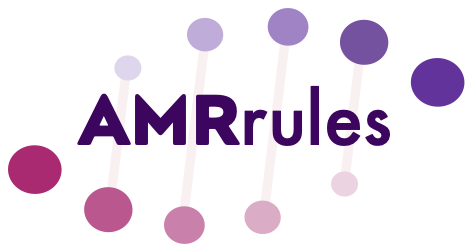

# AMRrulesCuration

This repository is the home of the ESGEM-AMR Working Group, which focuses on curating organism-specific rule sets for interpreting AMR genotypes under the [AMRrules](https://github.com/interpretAMR/AMRrules) framework.

The goal of AMRrules is to develop interpretive standards for AMR genotypes, akin to the interpretive standards developed by [EUCAST](https://www.eucast.org/) and [CLSI](https://clsi.org/) for antimicrobial susceptibility phenotyping.

An overview of the concept, with example data structures and code, is available in the [AMRrules](https://github.com/interpretAMR/AMRrules) repository. 

We have partnered with [ESGEM, the ESCMID Study Group on Epidemiological Markers](https://www.escmid.org/esgem/), to form an ESGEM-AMR Working Group to curate organism-specific rule sets. 
* Slides from the introductory webinars held May 14/15 are available [here](https://github.com/interpretAMR/AMRrulesCuration/blob/main/slides/ESGEM-AMR%20Webinar.pdf).
* A detailed description of the Working Group and the overall AMRrules approach is available [here](https://github.com/interpretAMR/AMRrulesCuration/blob/main/ESGEM-AMR%20Working%20Group.pdf), including scope, plans and timeline.
* Technical guidance for curation of rule sets is available [here](https://github.com/interpretAMR/AMRrulesCuration/blob/main/ESGEM-AMR%20Technical%20Guidance%20v1.2.pdf), this is a work in progress and will be refined as we go.
* The rule specification template is [here (v0.2, under active development)](https://docs.google.com/spreadsheets/d/14fuGcn-29OpYNeIpsjQ1MsPB3pqo4iz044fc4HLQHZI/edit?usp=sharing).

## Working Group Members

The convenors of the ESGEM-AMR Working Group are Kat Holt (LSHTM), Natacha Couto (ESGEM Chair), and Jane Hawkey (Monash, leading bioinformatics development).

A call for members was launched at the ESGEM General Meeting on April 29 and closed June 2. Over 120 applications were received and most of these have been invited to join organism-focused subgroups. The initial list of members is posted [below](member-list-by-subgroup).

Additional requests to join ESGEM-AMR will be considered later in the year, once the subgroups are up and running and it is clear where additional help would be beneficial. In the meantime you may register your interest and let us know what organism/s you have expertise in, using [this form](https://docs.google.com/forms/d/e/1FAIpQLSeH96VlioxLKarZOLMqD-f1fLnb9WYOHYz4tZ9NtQzpHrKyzw/viewform?usp=sf_link).

## Partners

We are partnering with EUCAST to ensure alignment of the AMRrules approach with the [EUCAST Subcommittee on WGS and Phenotypic AST](https://www.eucast.org/organization/subcommittees/wgs_and_phenotypic_testing) (including their [first report (2017)](https://doi.org/10.1016/j.cmi.2016.11.012) and ongoing updates), as well as important EUCAST concepts and guidance including [Expected Phenotypes](https://www.eucast.org/expert_rules_and_expected_phenotypes/expected_phenotypes), [Expert Rules](https://www.eucast.org/expert_rules_and_expected_phenotypes), [wildtype distributions and ECOFFS](https://mic.eucast.org/), and [Resistance Mechanisms](https://www.eucast.org/resistance_mechanisms).

We are keen to partner with other allied organisations and initiatives, please [get in touch](https://www.escmid.org/contact/) if you'd like to discuss.

## Member Resources

* AMRrules Spec - v0.2 [[google sheet]](https://docs.google.com/spreadsheets/d/14fuGcn-29OpYNeIpsjQ1MsPB3pqo4iz044fc4HLQHZI/edit?usp=sharing)
* AMRrules Technical Guidance - v1.2 [[PDF]](https://github.com/interpretAMR/AMRrulesCuration/blob/main/ESGEM-AMR%20Technical%20Guidance%20v1.2.pdf)
* GTDB taxonomy: [[browser]](https://gtdb.ecogenomic.org/) [[GTDBtk software]](https://github.com/Ecogenomics/GTDBTk)
* CARD/Antimicrobial Resistance Ontology (ARO): [[browser]](https://card.mcmaster.ca/)
* Drug class definitions: [ATC Index](https://atcddd.fhi.no/atc_ddd_index/)
* Variant specification: [HGVS](https://hgvs-nomenclature.org/stable/)
* EUCAST: [[Breakpoints]](https://www.eucast.org/clinical_breakpoints) [[Expected Resistance]](https://www.eucast.org/expert_rules_and_expected_phenotypes/expected_phenotypes)
* NCBI AMRfinderplus: [[software]](https://www.ncbi.nlm.nih.gov/pathogens/antimicrobial-resistance/AMRFinder/)
* NCBI refgene (AMR Gene Catalog): [[browser]](https://www.ncbi.nlm.nih.gov/pathogens/refgene/)
* NCBI AMR Reference Gene Hierarchy: [[browser]](https://www.ncbi.nlm.nih.gov/pathogens/genehierarchy) [[TXT file download]](https://ftp.ncbi.nlm.nih.gov/pathogen/Antimicrobial_resistance/AMRFinderPlus/database/latest/ReferenceGeneHierarchy.txt)
* NCBI refseq: [[browser]](https://www.ncbi.nlm.nih.gov/refseq/)
* NCBI AST data: [[browser]](https://www.ncbi.nlm.nih.gov/pathogens/ast/)
* NCBI AST data submission: [[info]](https://www.ncbi.nlm.nih.gov/pathogens/submit-data/) [[submission format]](https://www.ncbi.nlm.nih.gov/biosample/docs/antibiogram/)
* Introductory webinar slides: [[PDF]](https://github.com/interpretAMR/AMRrulesCuration/blob/main/slides/ESGEM-AMR%20Webinar.pdf)
* Kickoff meeting slides: [[PDF]](https://github.com/interpretAMR/AMRrulesCuration/blob/main/slides/ESGEM-AMR%20Kickoff%20slides.pdf)

## Member List (by subgroup)

***Data & Tools -*** *Jane Hawkey/Kat Holt*, Andrew McArthur, Finlay Maguire, Michael Feldgarden, Brody Duncan, Kristy Horan, Leonid Chindelevitch, Kara Tsang, Amogelang Raphenya, Dag Harmsen, Emily Bordeleau, Mackenzie Wilke, Romain Pogorelcnik, Torsten Seemann, Yu Wan, Zoe Dyson, Bogdan Iorga, Derek Sarovich

***Enterococcus -*** *Francesc Coll*, Thomas Demuyser, Ana R. Freitas, Guido Werner, Precious Osadebamwen, Theo Gouliouris, Fiona Walsh, Valeria Bortolaia

***Staphylococcus -*** *Natacha Couto/Guido Werner*, Birgitta Duim, Valeria Bortolaia, Sarah Baines, Sandra Reuter, Assaf Rokney, Holly Grace Espiriu, Manal AbuOun, Sankarganesh Jeyaraj

***Acinetobacter baumannii -*** *Paul Higgins*, Rahul Garg, Mehrad Hamidian, Bogdan Iorga, Priyanka Khopkar-Kale, Margaret Lam, Bruno Silvester Lopes, Ignasi Roca, Varun Shamanna, Clement Tsui, David Wareham, Valeria Bortolaia

***Enterobacter -*** *Teresa Coque/Rafael Canton*, Paul Higgins, Fernando Lazaro Perona, Po-Yu Liu, Elena Martinez, Rietie Venter, Ana Budimir, Angela Novais, Patrick Harris, Valeria Bortolaia

***Pseudomonas aeruginosa -*** *Antonio Oliver*, Adriana Cabal Rosel, Alasdair Hubbard, Bogdan Lorga, Xena Li, Carla Lopez Causape, Juliette Severin, David Wareham, Adam Witney, Ørjan Samuelsen, Bela Kocsis, Joana Moreira da Silva, Derek Sarovich, Fernando Lazaro Perona, Valeria Bortolaia 

***Klebsiella pneumoniae -*** *Kat Holt/Kara Tsang*, Valeria Bortolaia, Adam Komorowski, Elisenda Miro, Jon Iredell, Ørjan Samuelsen, Sally Partridge, Manal AbuOun, Sandra Reuter, Sankarganesh Jeyaraj, Fernando Lazaro Perona, Richard Goodman, Teresa Conque, Bogdan Iorga, Clement Tsui, Margaret Lam, Priyanka Khopkar-Kale, Varum Shamanna, Adam Witney, Alasdair Hubbard, Nicole Stoesser, Sam Lipworth, Deepali Desai, +KlebNet Geno/Pheno Consortium

***Escherichia coli/Shigella -*** *Kate Baker*, Pieter-Jan Ceyssens, Fiona Walsh, Carolina Silva Nodari, Soe Yu Naing, Richard Goodman, Abdurrahman Hassan Jibril, Jelalu Kemal Birmeka, Elena Martinez, Teresa Coque, Ramon Maluping, Ana Vale, Gultekin Unal, Axel Hamprecht, Valeria Bortolaia, Bogdan Lorga, Alasdair Hubbard, Manal AbuOun, Jon Iredell, Sally Partridge, Nicole Stoesser, Sam Lipworth, Florence Crombe

***Salmonella enterica -*** *Kristy Horan/Pieter-Jan Ceyssans*, Anthony Smith, Gültekin Ünal, Abdurrahman Hassan Jibril, Manal AbuOun, Jelalu Kemal Birmeka, Varun Shamanna, Assaf Rokney, Malgorzata Ligowska-Marzeta, Megan Carey

***Neisseria gonorrhoeae -*** *Leonor Sanchez Buso*, Yonatan Grad, Sheeba Manoharan-Basil, Martin McHugh, Tatum Mortimer, Anna Roditscheff, Faina Wehrli, Adam Witney

***Mycobacterium tuberculosis -*** Leonid Chindelevitch, Iñaki Comas, Philip Fowler, Kristy Horan, Priyanka Khopkar-Kale, Mariana López, Conor Meehan, Adam Witney, Brian Alcock

***Streptococcus -*** *Mario Ramirez*, Assaf Rokney, Holly Grace Espiriu

***Campylobacter -*** *Birgitta Duim*, Bruno Silvester Lopes, Malgorzata Ligowska-Marzeta, Assaf Rokney, Jelalu Kemal Birmeka

***Haemophilus influenzae -*** *Assaf Rokney*, Charlotte Michel, Priyanka Khopkar-Kale, Derek Sarovich

***Anaerobes -*** *Trefor Morris*, Ulrik Stenz Justesen, Marcela Krutova, Linda Veloo, Kathleen Boiten

***Stenotrophomonas maltophilia -*** *Jane Hawkey*, Derek Sarovich, David Wareham, Fiona Walsh, Rietie Venter, Kat Holt

***Serratia -*** *Sandra Reuter*, Teresa Coque, Adam Komorowski

***Achromobacter xylosoxidans -*** *Charlotte Michel*

***Aeromonas -*** *Po-Yu Liu*

***Shewanella -*** *Po-Yu Liu*

***Bordetella -*** *Laurence Luu*, Carla Rodrigues

***Brucella -*** *Jelalu Kemal Birmeka*

***Listeria -*** *Jelalu Kemal Birmeka*

***Edwardsiella -*** *Jelalu Kemal Birmeka*

***Pasteurella -*** *Jelalu Kemal Birmeka*

***Burkholderia cepacia complex -*** *Charlotte Michel*, David Wareham

***Burkholderia pseudomallei -*** *Claire Chewapreecha*, Derek Sarovich, Jessica Webb

***Chryseobacterium indologenes -*** *Rietie Venter*

***Corynebacterium diphtheriae -*** *Sylvain Brisse*

***Legionella -*** *Charlotte Michel*, Ghislaine Descours 

***Mycoplasma pneumoniae -*** *Mike Beeton*

***Neisseria meningitidis -*** *Célia Bettencourt*, Leonor Sanchez Buso

***Proteus mirabilis -*** *Axel Hamprecht*

***Treponema -*** *Brian Alcock*

***Vibrio -*** *Assaf Rokney*

***Yersinia -*** *Pieter-Jan Ceyssens*, Cyril Savin
